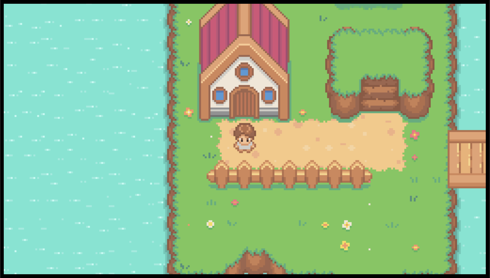
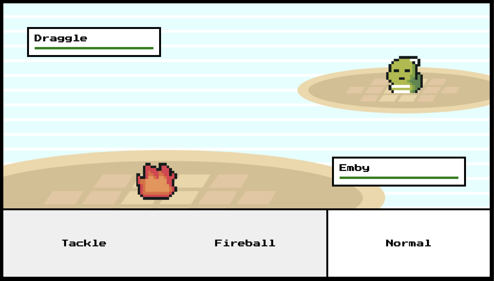

# 2D RPG Proof of Concept
> 2D Pokemon-like game built entirely with Javascript, HTML, and CSS.
> Live demo [_here_](2drpggameconcept.vercel.app). 

## Table of Contents
* [General Info](#general-information)
* [Technologies Used](#technologies-used)
* [Features](#features)
* [Screenshots](#screenshots)
* [Setup](#setup)
* [Usage](#usage)
* [Project Status](#project-status)
* [Room for Improvement](#room-for-improvement)
* [Acknowledgements](#acknowledgements)
* [Contact](#contact)

## General Information
- Simple 2D game demonstrating HTML Canvas with user inputs and GSAP animations
- I wanted to follow a tutorial (this one is based on Chris Courses' Pokemon Javascript Game with HTML Canvas) that would scale something relatively difficult using HTML Canvas and Javascript

## Technologies Used
- Javascript
- HTML 5
- CSS 3
- GSAP v.3.10.1 
- HowlerJS v.2.2.3

## Features
- Navigate 2D environment using WASD, complete with barriers and elevation
- Engage in battles by walking in the dark patched of grass
- Re-enter the map after completion of battle, win or lose

## Screenshots

## Usage
Navigate using WASD and click for button interaction

## Project Status
Project is: _in progress_. 
- Basic structure of game is complete, but I will be adding a start screen with explanation of controls, original battle music, and small bug fixes

## Room for Improvement
Room for improvement:
- Could make the initial startup a bit more informative
- Better barrier sizes for easier navigation

To do:
- Implement startup screen when site loads that explains movement buttons and click interactions
- Different battle background music
- Tidy up code for readability

## Acknowledgements
- This project was based on [this tutorial](https://www.youtube.com/watch?v=yP5DKzriqXA&t=6545s&ab_channel=ChrisCourses).